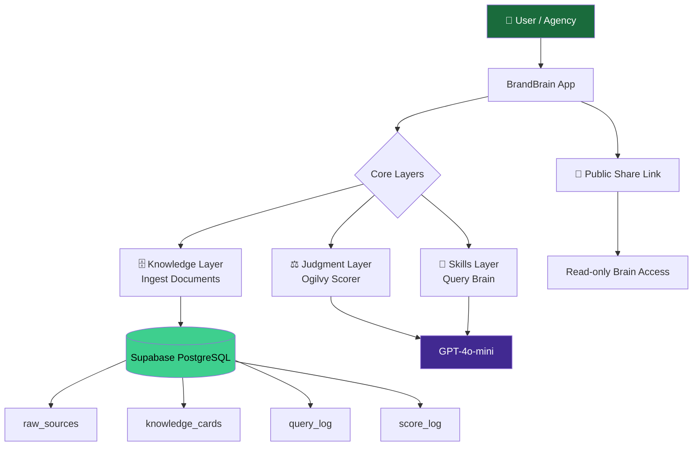
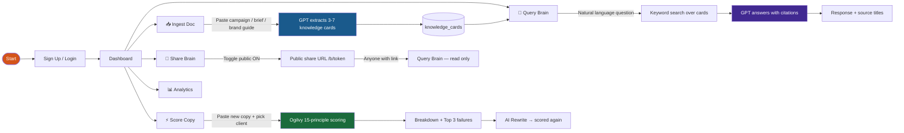
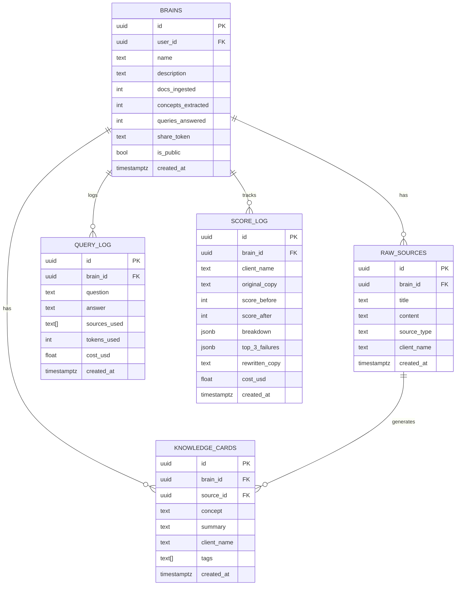
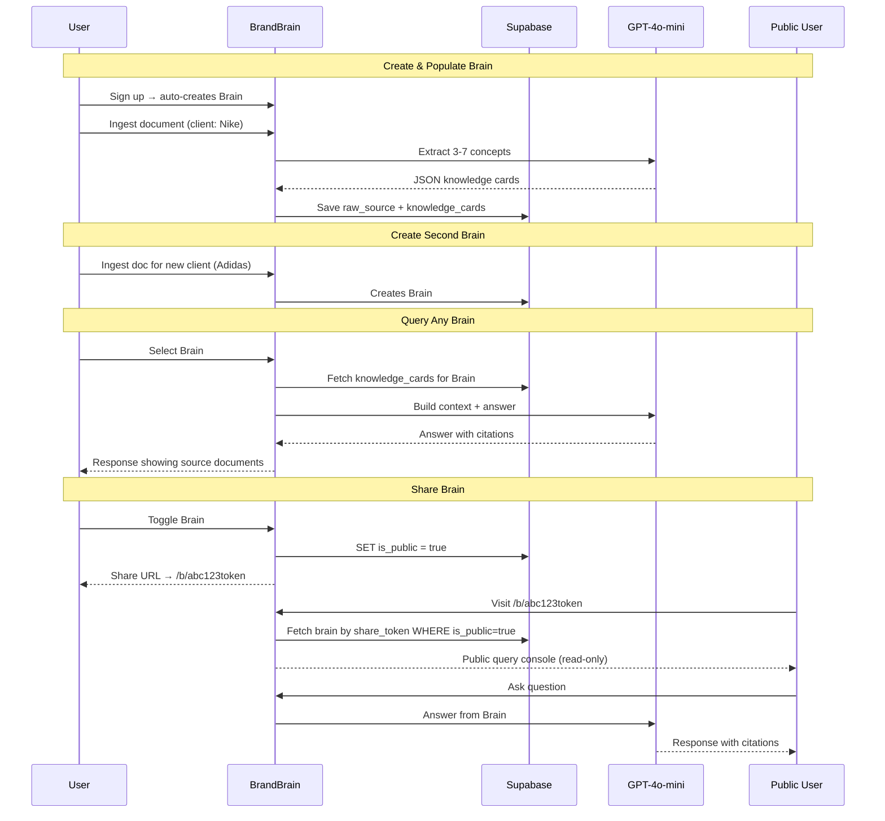
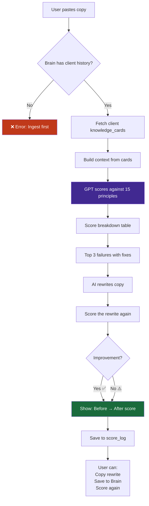
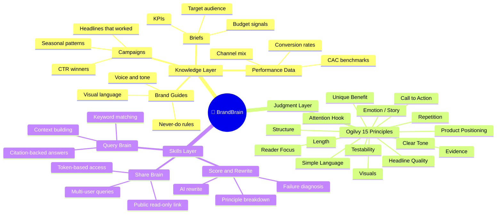
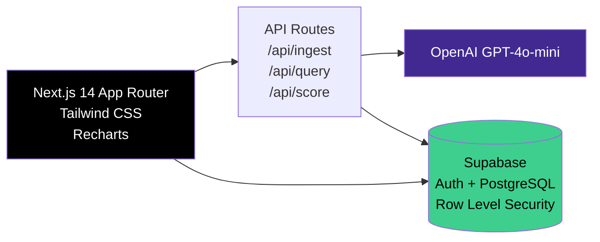

# 🧠 BrandBrain

> **Living Company Brain for marketing agencies.**  
> Ingest campaigns → Extract knowledge → Score copy → Share intelligence.

[](https://outskill.com)
[](https://nextjs.org)
[](https://supabase.com)
[](https://openai.com)

---

## What is BrandBrain?

Most agencies lose 40% of their institutional knowledge every time a senior hire leaves. BrandBrain makes that knowledge permanent — ingesting your campaigns, briefs, and brand guides, then scoring every new piece of copy against your own best work using David Ogilvy's 15 advertising principles.

---

## Architecture Overview



---

## User Flow



---

## Database Schema



---

## Multi-Brain & Sharing Flow



---

## Ogilvy Scoring Flow



---

## Three-Layer Company Brain Model



---

## Tech Stack



---

## Features

### 🗄️ Knowledge Layer — Ingest
- Paste campaigns, briefs, brand guides, or performance data
- GPT-4o-mini extracts **3–7 structured knowledge cards** per document
- Each card: concept + summary + tags + client name
- Multiple brains per user — one per client or project

### ⚖️ Judgment Layer — Ogilvy Copy Scoring
- Score any copy **0–100** using David Ogilvy's 15 advertising principles
- Benchmarked against your **own client's past winning campaigns**
- Get a detailed breakdown, top 3 failure diagnoses, and an AI rewrite
- Before vs After score tracked in analytics

### 🔧 Skills Layer — Query Brain
- Ask anything in plain English
- Answers cite the **exact documents** they came from
- No hallucinations — only your agency's knowledge
- Works across multiple brains with the brain selector

### 🔗 Public Brain Sharing
- Toggle any brain public with one click
- Anyone with the `/b/{token}` URL can query — no login required
- Read-only access, no data modification possible
- Share with clients, new hires, or the world

### 📊 Analytics
- Copy quality over time (before vs after scores)
- Queries per day (last 7 days)
- Total docs, concepts, queries, scores

---

## Local Setup

```bash
# 1. Clone and install
git clone <your-repo>
cd brandbrain
npm install

# 2. Environment variables
cp .env.local.example .env.local
# Fill in:
# NEXT_PUBLIC_SUPABASE_URL=
# NEXT_PUBLIC_SUPABASE_ANON_KEY=
# SUPABASE_SERVICE_ROLE_KEY=
# OPENAI_API_KEY=

# 3. Database
# Run supabase/migrations/001_initial.sql in your Supabase SQL editor
# Then run 002 and 003

# 4. Run
npm run dev
```

---

## API Reference

### POST /api/ingest
```json
{
  "brainId": "uuid (optional — creates one if missing)",
  "sourceType": "campaign | brand_guide | brief | performance_data",
  "clientName": "Nike",
  "title": "Summer 2026 Campaign",
  "content": "Full document text..."
}
```
Returns: `{ brain_id, concepts: [...], count, cost_usd }`

### POST /api/query
```json
{
  "brainId": "uuid",
  "question": "What tone works best for youth FMCG?",
  "shareToken": "optional — for public brain access"
}
```
Returns: `{ answer, sources: ["Doc title 1", ...], cost_usd }`

### POST /api/score
```json
{
  "brainId": "uuid",
  "clientName": "Nike",
  "copy": "Your copy to score here..."
}
```
Returns: `{ overall_score, breakdown, top_3_failures, rewrite, rewrite_score, cost_usd }`

---

## Hackathon Context

**OpenAI × Outskill AI Builders Hackathon — May 2026**

| Milestone | Date | Status |
|-----------|------|--------|
| Kickoff | Mon 26 May | ✅ Done |
| Product brief + MVP | Wed 28 May | ✅ Submitting |
| Final Go Live | Fri 30 May | 🚀 In progress |

**Built for:** Developers, AI engineers, product builders, and agencies who want their institutional knowledge to survive every team change.

---

## License

Private hackathon project — BrandBrain © 2026
